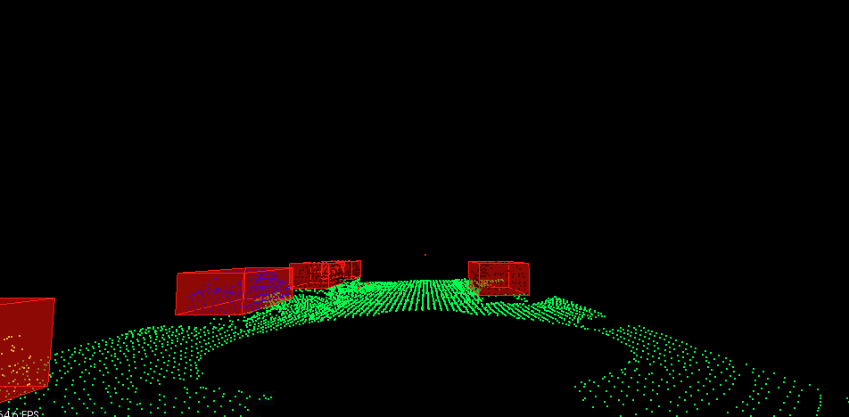
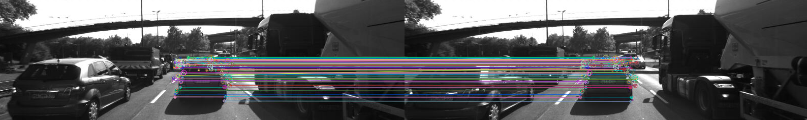
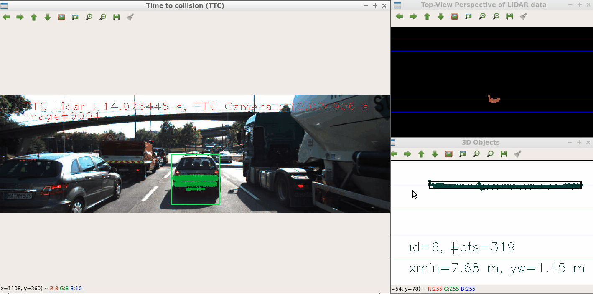
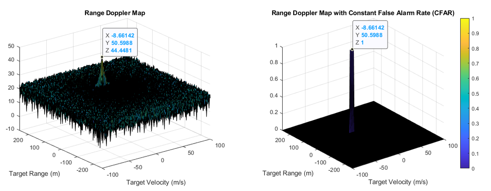

# Sensor Fusion Engineer Nanodegree Program in Udacity

## 1_LidarObstacleDetection
This module performs obstacle detection in a simulated highway environment using lidar data. I implemented the segmentation of ground and obstacle point clouds with 3D RANSAC algorithm, Euclidean clustering with KD-Tree data structure, and bounding boxes. In the final result shown below, the ground plane and obstacles (cars and poles) are accurately detected. 

## 2_Camera
This module consits of two projects: 2D_Feature_Matching and 3D_Object_Tracking 

The goal of this final project is to estimate the time-to-collision (TTC) using LiDAR and camara data. The process is as follows:
- Implement keypoint detection and descriptor extraction
- Add bounding boxes of objects using YOLO
- Project 3D LiDAR point cloud data onto the bounding box of 2D camera images
- Calculate TTC using two consecutive camera images

## 3_Radar
The goal of this module is to estimate the range and velocity of a moving object using a radar sensor. The process is as follows:
- Send a Frequency Modulated Continuous Wave (FWCW) radar signals to a moving object
- Construct beat signals based on transmitted and received signals
- Perform 2D FFT on beat signals to generate a range-doppler map
- Implement Constant False Alarm Rate (CFAR) on the range-doppler map to avoid false alarms due to clutter signals that are generally produced by the reflections from the ground, sea, buildings, trees, rain, fog etc.

## 4_KalmanFilter
This module performs sensor fusion with Lidar and Radar data using Unscented Kalman filter (UKF).

